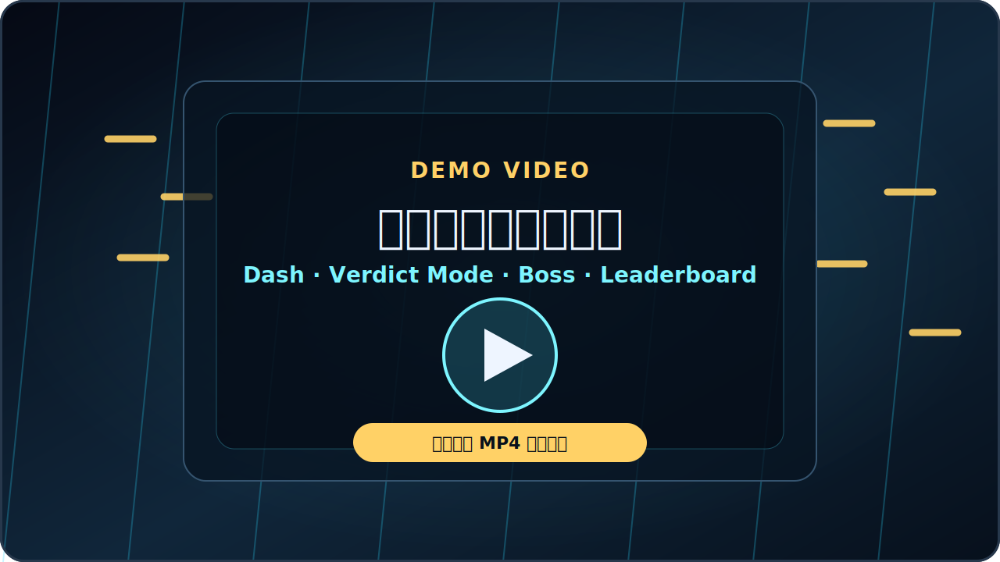

# Nightflight OJ / 良乡夜航


<p align="center">
  <a href="https://netflight.bitdate.date/">在线体验</a>
  ·
  <a href="#本地运行">本地运行</a>
  ·
  <a href="#cloudflare-部署">Cloudflare 部署</a>
  ·
  <a href="DESIGN.md">设计文档</a>
</p>

<p align="center">
  
  
  
  
  
</p>

**良乡夜航** 是一个以 Online Judge 压力测试为主题的浏览器弹幕生存游戏。玩家驾驶夜航机体穿过弹幕，靠擦弹、Perfect Dash、判题模式和机体改造一路扛到 Boss 压力测试，把成绩打上在线排行榜。

项目主体是原生 HTML/CSS/JavaScript + Canvas 2D，不需要前端构建链；在线排行榜和房间同步能力使用 Cloudflare Pages Functions、D1 和 Durable Objects 扩展。

## 演示视频

<p align="center">
  <a href="docs/demo.mp4">
    
  </a>
</p>

<p align="center">
  <a href="docs/demo.mp4">点击播放演示视频</a>
</p>

## 现在能玩什么

| 模块 | 状态 | 说明 |
| --- | --- | --- |
| 单机弹幕生存 | 可玩 | 敌机波次、道具、Boss 阶段、结算和本地档案都已实现 |
| 在线排行榜 | 可部署 | 一个用户名就是玩家标识，最高分和总积分写入 D1 |
| 触屏模式 | 可玩 | 支持相对拖动和虚拟摇杆，手指可以放在偏移位置微操，不遮挡自机 |
| 手柄模式 | 可玩 | 浏览器 Gamepad API，支持摇杆、方向键、面键和肩键 |
| 联机房间 | 实验性 | 房间 WebSocket、玩家状态广播和双人排行榜接口已包含，可继续扩成完整同步双人 Boss 战 |
| 宣传视频工具 | 可运行 | Playwright 自动操控真实游戏画面并导出竖屏宣传素材 |

## 游戏亮点

- **OJ 主题弹幕：** 隐藏样例、系统测试、终测机都变成 Boss 压力测试。
- **Perfect Dash：** 贴弹冲刺可拿分、叠倍率、充能，风险越高收益越高。
- **判题模式：** 能量满后触发清屏、削血和短时间火力强化。
- **Roguelite 改造：** 主炮、引擎、冲刺、协议、生存和 Boss 特化路线可组合。
- **统一用户名档案：** 不拆账号和 ID，本地档案与排行榜都以同一个用户名识别。
- **多输入支持：** 键盘、手机触屏、手柄都能完整操作菜单、战斗、暂停和升级选择。
- **零素材负担：** 音效和背景音乐由 Web Audio 程序化生成，开箱即可跑。

## 操作方式

| 动作 | 键盘 | 手机触屏 | 手柄 |
| --- | --- | --- | --- |
| 移动 | `WASD` / 方向键 | 相对拖动 / 左侧虚拟摇杆 | 左摇杆 / D-pad |
| 冲刺 | `Shift` | `D` 按钮 | `B` / 肩键 |
| 判题模式 | `Space` | `OJ` 按钮 | 面键 |
| 暂停 | `P` / `Esc` | `P` 按钮 | Start / Menu |
| 升级选择 | 方向键 + `Enter` / `Space` | 点击卡片 | D-pad + 面键 |

## 本地运行

最简单的方式是直接打开 `index.html`。如果浏览器限制本地接口或你想模拟线上路径，用静态服务器启动：

```powershell
python -m http.server 8000
```

然后访问：

```text
http://localhost:8000/
```

Windows 下也可以双击 `run_game.bat` 快速启动。

## 分数与成长

分数来自生存时间、击杀、Boss 伤害、道具拾取、擦弹和 Perfect Dash 连段。达到这些里程碑会触发机体改造：

```text
9000 -> 22000 -> 42000 -> 70000 -> 108000 -> 158000 -> 225000
```

本地档案保存在 `localStorage`。玩家只需要一个用户名；下次输入同一用户名会读取该 ID 的本地档案，并在部署了排行榜 API 时尝试同步云端档案。

## 项目结构

```text
.
|-- index.html                 # 游戏页面入口
|-- run_game.bat               # Windows 快速启动脚本
|-- db/
|   `-- schema.sql             # Cloudflare D1 排行榜表结构
|-- functions/
|   `-- api/                   # Cloudflare Pages Functions
|-- worker/
|   `-- room-worker.js         # Durable Object 房间服务
|-- src/
|   |-- audio.js               # Web Audio 音乐和音效
|   |-- content.js             # 段位、Boss、升级卡配置
|   |-- game.js                # Canvas 2D 游戏主循环
|   |-- leaderboard.js         # 排行榜客户端
|   |-- profile.js             # 用户名档案和 localStorage
|   `-- styles.css             # 响应式 UI、触屏和手柄提示
|-- tools/
|   |-- make-marketing-promo-mp4.mjs
|   |-- make-marketing-promo.mjs
|   |-- make-marketing-cover.mjs
|   |-- make-promo-video.mjs
|   `-- make-promo-cover.mjs
`-- docs/
    |-- banner.svg             # README 横幅
    |-- demo-poster.svg        # 演示视频预览图
    |-- demo.mp4               # 演示视频
    `-- cover.png              # 历史宣传封面
```

## Cloudflare 部署

仓库提供了 Cloudflare 配置模板：

```powershell
Copy-Item wrangler.example.toml wrangler.toml
```

然后把 `wrangler.toml` 里的 `REPLACE_WITH_YOUR_D1_DATABASE_ID` 替换成自己的 D1 database ID。真实的 `wrangler*.toml` 默认被 `.gitignore` 忽略，避免把账号、数据库和部署配置提交到公开仓库。

初始化 D1 表结构：

```powershell
npx wrangler d1 execute nightflight_leaderboard --file db/schema.sql
```

包含的线上接口：

| 路径 | 用途 |
| --- | --- |
| `GET /api/leaderboard` | 读取单人 Top 10 和指定用户名档案 |
| `POST /api/leaderboard` | 提交单人成绩 |
| `GET /api/duo-leaderboard` | 读取双人榜 |
| `POST /api/duo-leaderboard` | 提交双人成绩 |
| `GET /api/room/:room` | WebSocket 房间入口 |

Pages/Workers 的具体发布方式取决于你的 Cloudflare 项目设置。建议把真实配置留在本机或 Cloudflare 控制台，不要提交到 GitHub。

## 宣传视频工具

宣传素材脚本在 `tools/` 目录里。生成竖屏 MP4：

```powershell
npm install
npm run promo:mp4
```

脚本会用 Playwright 打开游戏、操控真实游戏画面、切换排行榜/触屏/手柄等功能特写，并通过浏览器 `MediaRecorder` 导出视频。

如果想指定本机浏览器：

```powershell
$env:BROWSER_PATH = "C:\Program Files (x86)\Microsoft\Edge\Application\msedge.exe"
npm run promo:mp4
```

生成内容默认输出到 `promo-output/`，该目录不会进入 git。

## 开发说明

- 游戏本体不需要 `npm install`，浏览器能打开就能玩。
- `npm install` 只用于 Cloudflare CLI、静态服务器和宣传视频脚本。
- 线上配置、部署产物、录屏产物和 Playwright 检查输出都已在 `.gitignore` 中排除。
- 主要玩法参数集中在 `src/content.js`，手感、同步、碰撞和绘制逻辑集中在 `src/game.js`。

## License

MIT. See [LICENSE](LICENSE).
