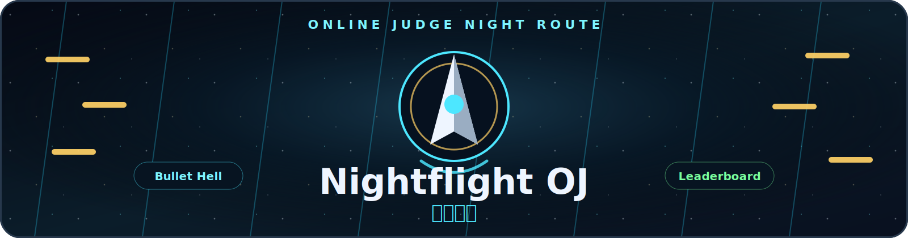
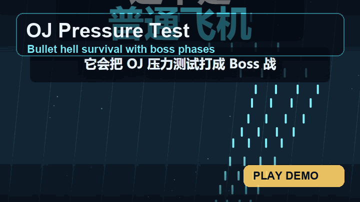

# Nightflight OJ / 良乡夜航



<p align="center">
  <a href="https://netflight.bitdate.date/">在线体验</a>
  ·
  <a href="#演示动图">演示动图</a>
  ·
  <a href="#玩法">玩法</a>
  ·
  <a href="#操作方式">操作方式</a>
  ·
  <a href="#本地运行">本地运行</a>
</p>

<p align="center">
  
  
  
  
  
</p>

**良乡夜航** 是一款浏览器弹幕生存游戏：把 Online Judge 的隐藏样例、系统测试和终测压力做成 Boss 战。玩家驾驶夜航机体，在密集弹幕里擦弹、冲刺、开大、升级，最后把自己的用户名打上排行榜。

游戏不需要下载安装，打开网页就能玩。它更像一局“刷题压力测试”：样例过了不算结束，真正的危险从隐藏数据开始。

## 演示动图

<p align="center">
  
</p>

动图展示的是实际游戏画面剪辑：开局弹幕、Perfect Dash、判题模式、Boss 压力测试和排行榜特写。

## 玩法

一局游戏的节奏很直接：

1. **自动射击，专注走位。** 机体会持续开火，玩家主要负责躲弹、找安全线和抓冲刺窗口。
2. **擦弹和 Perfect Dash 充能。** 越贴近危险，越能拿到分数、倍率和判题能量。
3. **判题模式清屏反打。** 能量满后开大，清除弹幕、削 Boss 血量，并短时间提高火力。
4. **击破 Boss 或到达分数里程碑后升级。** 每次从随机升级卡中选一张，形成不同构筑路线。
5. **结算后冲排行榜。** 只用一个用户名保存档案和成绩，不需要学号、密码或额外账号。

## 核心机制

### Perfect Dash

`Shift` 是整局游戏的核心键。冲刺时会获得短暂无敌窗口，能从弹幕缝隙里穿出去。贴近弹幕冲刺会触发 Perfect Dash，奖励分数、倍率和判题能量。

冲刺等级越高，冷却越短，无敌窗口也更宽。高等级冲刺会把游戏从“躲弹”变成“主动贴弹拿收益”。

### 判题模式

判题能量到 100% 后按 `Space` 触发。效果包括：

- 清除当前屏幕上的危险弹幕。
- 对普通敌人和 Boss 造成伤害。
- 短时间提升火力，让机体进入爆发输出状态。

它既是保命技能，也是 Boss 战里的爆发窗口。什么时候忍住不放、什么时候果断清屏，是高分的关键。

### Boss 压力测试

Boss 不只是血更厚的敌人，而是不同类型的 OJ 压力：

| Boss | 主题 | 压力 |
| --- | --- | --- |
| 隐藏样例：边界风暴 | 边界条件 | 环形弹幕和空间压缩 |
| 系统测试：内存漩涡 | 复杂度压力 | 扇形瞄准和节奏变化 |
| 终测机：红名守门人 | 最终验题 | 螺旋弹和高速点名弹 |

Boss 血量降低后会进入新 Phase，弹幕形态会变得更激进。击破 Boss 会带来明显的阶段奖励和升级机会。

### 机体改造

升级卡决定一局的打法。当前路线大致分为：

| 路线 | 代表效果 | 风格 |
| --- | --- | --- |
| 火力 | 主炮等级、弹道数量、射速 | 更快压掉敌人和 Boss |
| 机动 | 引擎速度、冲刺等级 | 更细的走位和更高的冲刺收益 |
| 协议 | 判题模式、护盾收益 | 更强的清屏和容错 |
| 生存 | 最大生命、回复、护盾 | 更稳地拖到后期 |
| 技巧 | 擦弹收益、Perfect Dash 收益 | 高风险高回报 |

每次升级只给几张选择，不会把玩家丢进复杂菜单里。读牌、判断局势、选路线，是它的 Roguelite 味道。

## 分数和排行榜

分数来自这些行为：

- 存活时间。
- 击杀敌人和伤害 Boss。
- 拾取道具。
- 擦弹。
- Perfect Dash 连段。
- 判题模式清屏。

排行榜只显示用户名和成绩摘要。玩家下次输入同一个用户名，就会继续使用这个身份记录成绩。

## 操作方式

| 动作 | 键盘 | 手机触屏 | 手柄 |
| --- | --- | --- | --- |
| 移动 | `WASD` / 方向键 | 相对拖动 / 虚拟摇杆 | 左摇杆 / D-pad |
| 冲刺 | `Shift` | `D` 按钮 | `B` / 肩键 |
| 判题模式 | `Space` | `OJ` 按钮 | 面键 |
| 暂停 | `P` / `Esc` | `P` 按钮 | Start / Menu |
| 升级选择 | 方向键 + `Enter` / `Space` | 点击卡片 | D-pad + 面键 |

手机端支持“手指在别处微操”的相对拖动方式，不需要把手指压在自机上。这样弹幕密集时不会挡住判定点。

## 适合谁玩

- 喜欢弹幕游戏、躲避游戏、滚动类反应游戏的玩家。
- 喜欢刷排行榜、研究构筑和冲高分的人。
- 被 OJ 隐藏样例折磨过，但还想笑着再来一局的人。

## 本地运行

直接打开 `index.html` 即可运行。也可以启动一个本地静态服务器：

```powershell
python -m http.server 8000
```

然后访问：

```text
http://localhost:8000/
```

Windows 下可以双击 `run_game.bat` 快速启动。

## 开源说明

游戏主体使用原生 HTML、CSS、JavaScript 和 Canvas 2D 编写，音乐与音效由浏览器 Web Audio 生成。欢迎基于本项目继续做新 Boss、新升级卡、新皮肤或新的排行榜玩法。

## License

MIT. See [LICENSE](LICENSE).
